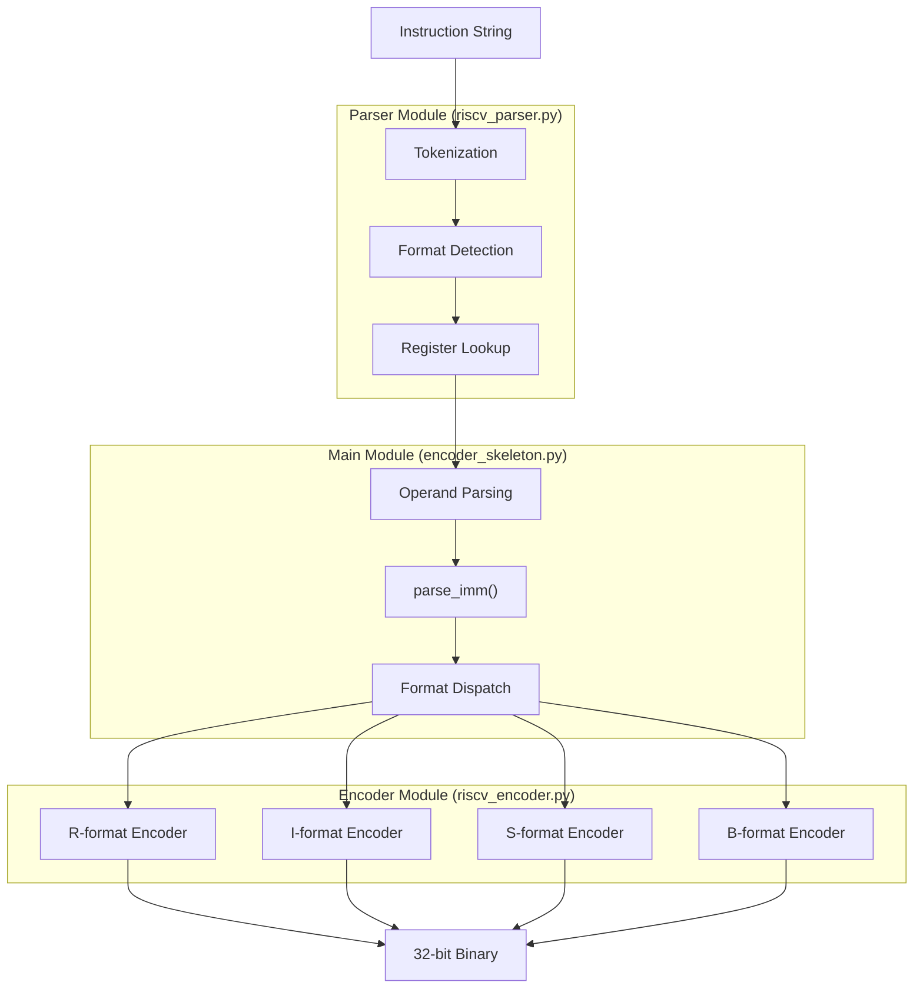

# RV32I Instruction Encoder - Technical Documentation

## 1. Architecture Overview

The encoder is designed as a modular, three-part architecture that separates: parsing, encoding, and orchestration. This structure ensures that each component has a single, well-defined responsibility, making the system easier to understand, test, and maintain.

### 1.1 Parser Module (`riscv_parser.py`)

The Parser handles the initial processing and validation of the assembly instruction string. Its core responsibilities include:

- **Tokenization:** Breaking down the instruction string into meaningful tokens (mnemonic, registers, immediates) by handling separators like commas, parentheses, and whitespace.
- **Metadata Management:** Loading all instruction formats, register mappings, and field definitions from the JSON configuration files. This approach decouples the code logic from the specific instruction set details.
- **Syntax Validation:** Verifying that the instruction mnemonic is supported and that the register names are valid.
- **Register Conversion:** Translating ABI (Application Binary Interface) register names (e.g., `sp`, `ra`) and numeric names (e.g., `x2`, `x1`) into their corresponding integer values (0-31).

### 1.2 Encoder Module (`riscv_encoder.py`)

This module is the core of the encoding logic. It is responsible for the low-level bit manipulation required to construct a valid 32-bit instruction. Its primary functions are:

- **Immediate Encoding:** Handling the conversion of immediate values (decimal, hexadecimal, binary, and PC-relative) into their binary representation with correct sign extension and range validation.
- **Format-Specific Construction:** Providing dedicated methods for each RISC-V instruction format (`R`, `I`, `S`, `B`). Each method places the opcode, funct3, funct7, register fields, and immediate fields into their correct bit positions to form a complete 32-bit word.
- **Validation:** Ensuring that all operands fall within their valid ranges (e.g., register numbers 0-31, immediate values within limits).

### 1.3 Main Module (`encoder_skeleton.py`)

The Main Module acts as the conductor of the encoding process. It coordinates the other components and manages the user interface. Its primary tasks are:

- **Command-Line Parsing:** Accepting a single instruction as a command-line argument.
- **Orchestration:** Tokenizing the instruction using the Parser, then calling the appropriate encoding method from the Encoder based on the detected instruction format.
- **Output Presentation:** Formatting and displaying the results in a clear, human-readable format. This includes a detailed visual breakdown of each instruction field, the 32-bit binary, and the final hexadecimal value required for automated validation.

## 2. Supported Instructions

The encoder is designed to support a specific subset of the RV32I base integer instruction set, covering the four main instruction formats. The following table lists each instruction, its format, and its unique encoding parameters.

| Instruction | Format | Opcode | Funct3 | Funct7 |
|-------------|--------|--------|--------|--------|
| `add`       | R      | 0110011| 000    | 0000000|
| `sub`       | R      | 0110011| 000    | 0100000|
| `and`       | R      | 0110011| 111    | 0000000|
| `or`        | R      | 0110011| 110    | 0000000|
| `addi`      | I      | 0010011| 000    | N/A    |
| `andi`      | I      | 0010011| 111    | N/A    |
| `lw`        | I      | 0000011| 010    | N/A    |
| `lb`        | I      | 0000011| 000    | N/A    |
| `sw`        | S      | 0100011| 010    | N/A    |
| `sb`        | S      | 0100011| 000    | N/A    |
| `beq`       | B      | 1100011| 000    | N/A    |
| `bne`       | B      | 1100011| 001    | N/A    |

> [!IMPORTANT] 
> **Source of Encoding Information**
> 
> All opcode, funct3, and funct7 values were obtained from the official RISC-V documentation to ensure correctness and compliance.
> 
> **Primary Reference:** The RISC-V Instruction Set Manual, Volume I: Unprivileged Architecture, Document Version 20260120. The format for each instruction type is defined in Chapter 1: RV32I Base Integer Instruction Set, Version 2.1. This document is available online at the official RISC-V documentation portal: <https://docs.riscv.org/reference/isa/v20260120/unpriv/rv32.html>
> 
> **Supplementary Reference:** The RV32I "Green Card", a concise quick-reference card summarizing the encoding of all base instructions. This was used as a cross-reference to verify the field values. It is available at: <https://notes.cs61c.org/content/misc/rv32i-green-card/>

## 3. Code Architecture

### 3.1 Data Flow

The encoding process follows a linear flow, display in the next diagram.



1.  **User Input:** The user provides an instruction string via the command line (e.g., `./run.sh "add x5, x6, x7"`).
2.  **Tokenization (`riscv_parser.py`):** The string is parsed into a list of tokens. For example, `add x5, x6, x7` becomes `['add', 'x5', 'x6', 'x7']`.
3.  **Format Detection (`riscv_parser.py`):** The instruction mnemonic (`add`) is looked up in the `riscv_inst.json` metadata to determine its format (`R`), opcode (`0110011`), and other control fields (funct3, funct7).
4.  **Operand Parsing (`encoder_skeleton.py`):** The operands (`x5`, `x6`, `x7`) are processed. The Parser converts register names to numeric values, and a dedicated `parse_imm()` function evaluates the immediate value (if any), supporting formats like decimal, hexadecimal, binary, and PC-relative expressions.
5.  **Encoding (`riscv_encoder.py`):** Based on the detected format (`R`, `I`, `S`, `B`), the appropriate encoding method is called. This method assembles the 32-bit instruction by placing the opcode, funct3, funct7, register numbers, and immediate value into their correct bit positions.
6.  **Output Generation:** The final 32-bit encoded word is used to generate the visual field breakdown, binary representation, and the required hexadecimal output.

### 3.2 Format Detection

The encoding process begins by identifying the instruction's format. The Parser handles this by looking up the instruction mnemonic in the `riscv_inst.json` file.

> [!NOTE]
> **How Format Detection Works**
> 
> The `riscv_inst.json` file serves as a central metadata repository. Each supported instruction is an entry in the JSON object, containing its format and encoding parameters.
> 
> ```json
> {
>   "add": {
>     "format": "R",
>     "opcode": "0110011",
>     "funct3": "000",
>     "funct7": "0000000"
>   }
> }
> ```
> 
> When an instruction like `add` is processed, the Parser:
> 1.  Confirms the instruction is supported.
> 2.  Retrieves its metadata, which includes the `format`.
> 3.  Returns the `format` string (`"R"`) and the encoding fields.

### 3.3 Operand Parsing

Once the format is known, the operands are validated and converted into a usable form. This is where the assembly syntax is translated into concrete data for the encoder.

> [!NOTE]
> **Immediate Parsing**
> 
> The `parse_imm()` function in the skeleton is responsible for converting the immediate operand from a string into an integer. It supports a variety of formats. This function is also responsible for handling PC-relative expressions (`.+N`, `.-N`) used in branch instructions.
> 
> | Input Format | Example | Parsed Integer Value |
> | :--- | :--- | :--- |
> | Decimal | `10`, `-12` | `10`, `-12` |
> | Hexadecimal | `0x100`, `-0x100` | `256`, `-256` |
> | Binary | `0b1010`, `-0b1010` | `10`, `-10` |
> | PC-relative | `.+8`, `.-80` | `8`, `-80` |

> [!WARNING]
>
> **B-Format Immediate Handling**
>
> The official RISC-V toolchain automatically optimizes branch instructions by modifying their encoding. To prevent this behavior and ensure correct encoding, branch immediates must be expressed as PC-relative offsets using the `.+N` (positive) or `.-N` (negative) syntax.

### 3.4 Encoding Process

After parsing, based on the detected format, the appropriate method in the Encoder module is called to construct the 32-bit instruction. These methods place each field into its designated bit range.

> [!TIP] 
> **Instruction Format Layouts**
> 
> The following diagrams show the exact bit layout for each of the four supported formats. This layout is critical for the encoder to correctly assemble the final binary word.
> 
> **R-Format (32 bits):**
> ```
> [funct7(7)] [rs2(5)] [rs1(5)] [funct3(3)] [rd(5)] [opcode(7)]
> ```
> 
> **I-Format (32 bits):**
> ```
> [imm(12)] [rs1(5)] [funct3(3)] [rd(5)] [opcode(7)]
> ```
> 
> **S-Format (32 bits):**
> ```
> [imm[11:5](7)] [rs2(5)] [rs1(5)] [funct3(3)] [imm[4:0](5)] [opcode(7)]
> ```
> 
> **B-Format (32 bits):**
> ```
> [imm[12](1)] [imm[10:5](6)] [rs2(5)] [rs1(5)] [funct3(3)] [imm[4:1](4)] [imm[11](1)] [opcode(7)]
> ```

## 4. Output Examples

The following examples demonstrate the visual output of the encoder for each instruction format. Each example showcases the field breakdown and the final binary and hexadecimal representations.

### 4.1 R-Format Example: `add x5, x6, x7`

```
[ INSTRUCTION ]
┌────────────────────┐
│   ADD X5, X6, X7   │
└────────────────────┘

ENCODING...
├ TOKENS: ['add', 'x5', 'x6', 'x7']
├ MNEMONIC: add
│	├── OPCODE: 0110011
│	├── FUNCT7: 0000000
│	└── FUNCT3: 000
├ ARG (REG): x5 (00101)
├ ARG (REG): x6 (00110)
├ ARG (REG): x7 (00111)
│
├ FORMAT:R
│	└── Register-to-register operations. All operands are registers, result stored in rd.
└──────────────────────────────────────────────────────────────────────────────────────────────
FIELD              BITS         BINARY           VALUE        DESCRIPTION
───────────────────────────────────────────────────────────────────────────────────────────────
funct7             25-31        0000000          0            Specifies exact operation with funct3. Contains opcode modifiers.
rs2                20-24        00111            7            Source register 2 - second operand.
rs1                15-19        00110            6            Source register 1 - first operand.
funct3             12-14        000              0            Specifies operation variant (ADD, SUB, etc.).
rd                 7-11         00101            5            Destination register - stores the result.
opcode             0-6          0110011          0x33         Operation code - 0x33 for R-format.
┌──────────────────────────────────────────────────────────────────────────────────────────────
└ ENCODING DONE (•ᴗ•)

BINARY: 00000000011100110000001010110011
HEX: 0x007302b3
```

### 4.2 I-Format Example: `addi x10, x1, -12`

```
[ INSTRUCTION ]
┌───────────────────────┐
│   ADDI X10, X1, -12   │
└───────────────────────┘

ENCODING...
├ TOKENS: ['addi', 'x10', 'x1', '-12']
├ MNEMONIC: addi
│	├── OPCODE: 0010011
│	├── FUNCT7: None
│	└── FUNCT3: 000
├ ARG (REG): x10 (01010)
├ ARG (REG): x1 (00001)
├ ARG (IMM): -12 (111111110100)
│
├ FORMAT:I
│	└── Immediate operations. Uses rd = rs1 op imm[11:0].
└──────────────────────────────────────────────────────────────────────────────────────────────
FIELD              BITS         BINARY           VALUE        DESCRIPTION
───────────────────────────────────────────────────────────────────────────────────────────────
imm[11:0]          20-31        111111110100     4084 (0xff4) 12-bit signed immediate value.
rs1                15-19        00001            1            Source register - operand.
funct3             12-14        000              0            Specifies operation variant (addi, andi, etc.).
rd                 7-11         01010            10           Destination register - stores the result.
opcode             0-6          0010011          0x13         Operation code - 0x13, 0x03, 0x67, 0x73, etc.
┌──────────────────────────────────────────────────────────────────────────────────────────────
└ ENCODING DONE (•ᴗ•)

BINARY: 11111111010000001000010100010011
HEX: 0xff408513
```

### 4.3 S-Format Example: `sw x8, -4(x2)`

```
[ INSTRUCTION ]
┌───────────────────┐
│   SW X8, -4(X2)   │
└───────────────────┘

ENCODING...
├ TOKENS: ['sw', 'x8', '-4', 'x2']
├ MNEMONIC: sw
│	├── OPCODE: 0100011
│	├── FUNCT7: None
│	└── FUNCT3: 010
├ ARG (REG): x8 (01000)
├ ARG (REG): x2 (00010)
├ ARG (IMM): -4 (111111111100)
│
├ FORMAT:S
│	└── Store operations. Stores rs2 at address rs1 + imm[11:0].
└──────────────────────────────────────────────────────────────────────────────────────────────
FIELD              BITS         BINARY           VALUE        DESCRIPTION
───────────────────────────────────────────────────────────────────────────────────────────────
imm[11:5]          25-31        1111111          127 (0x7f)   Upper 7 bits of 12-bit signed offset.
rs2                20-24        01000            8            Source register - contains value to store.
rs1                15-19        00010            2            Source register - base address.
funct3             12-14        010              2            Specifies store size: sw=010, sh=001, sb=000.
imm[4:0]           7-11         11100            28 (0x1c)    Lower 5 bits of 12-bit signed offset.
opcode             0-6          0100011          0x23         Operation code - 0x23 for S-format.
┌──────────────────────────────────────────────────────────────────────────────────────────────
└ ENCODING DONE (•ᴗ•)

BINARY: 11111110100000010010111000100011
HEX: 0xfe812e23
```

### 4.4 B-Format Example: `beq x1, x2, 8`

```
[ INSTRUCTION ]
┌───────────────────┐
│   BEQ X1, X2, 8   │
└───────────────────┘

ENCODING...
├ TOKENS: ['beq', 'x1', 'x2', '8']
├ MNEMONIC: beq
│	├── OPCODE: 1100011
│	├── FUNCT7: None
│	└── FUNCT3: 000
├ ARG (REG): x1 (00001)
├ ARG (REG): x2 (00010)
├ ARG (IMM): 8 (0000000001000)
│
├ FORMAT:B
│	└── Branch operations. PC-relative branch if condition (rs1, rs2) is true.
└──────────────────────────────────────────────────────────────────────────────────────────────
FIELD              BITS         BINARY           VALUE        DESCRIPTION
───────────────────────────────────────────────────────────────────────────────────────────────
imm[12]            31           0                0 (0x0)      Bit 12 (sign bit) of branch offset.
imm[10:5]          25-30        000000           0 (0x0)      Bits 10-5 of branch offset.
rs2                20-24        00010            2            Source register 2 - second operand.
rs1                15-19        00001            1            Source register 1 - first operand.
funct3             12-14        000              0            Branch condition: beq=000, bne=001, blt=100, bge=101, etc.
imm[4:1]           8-11         0100             4 (0x4)      Bits 4-1 of branch offset (bit 0 always 0).
imm[11]            7            0                0 (0x0)      Bit 11 of branch offset.
opcode             0-6          1100011          0x63         Operation code - 0x63 for B-format.
┌──────────────────────────────────────────────────────────────────────────────────────────────
└ ENCODING DONE (•ᴗ•)

BINARY: 00000000001000001000010001100011
HEX: 0x00208463
```

## 5. Validation Against Official Toolchain

### 5.1 Toolchain Installation

To validate the encoder's output, the official RISC-V GNU toolchain is needed. The following commands provide installation instructions for various operating systems:

#### Arch Linux
```bash
sudo pacman -S riscv64-elf-binutils
```

> [!CAUTION]
>
> **Development Platform**
>
> This project was built and tested exclusively on **Arch Linux**. The installation instructions and toolchain setup for other operating systems (Ubuntu, macOS, etc.) are provided as a reference, but may contain inaccuracies or require additional steps. Users are encouraged to consult their platform's official documentation for the most accurate setup procedures.

#### Ubuntu/Debian
```bash
sudo apt-get update
sudo apt-get install gcc-riscv64-unknown-elf
```

#### macOS (Homebrew)
```bash
brew install riscv-tools
```

#### From Source
```bash
git clone https://github.com/riscv-collab/riscv-gnu-toolchain
cd riscv-gnu-toolchain
./configure --prefix=/opt/riscv --with-arch=rv32i
make
```

### 5.2 Validation Results

The validation script (`validate.sh`) is designed to automatically test the encoder. It compares the encoder's output against the official RISC-V toolchain for a comprehensive suite of test instructions. To run the script, you provide it with one or more test files.

> [!TIP]
> **Running Validation**
> 
> The project includes several test files in the `tests/` directory. You can run the validation script in the following ways:
> 
> ```bash
> ./validate.sh tests/suite_<n>.txt         # Run 'n' tests for all 12 supported instructions (including positive, negative, and borderline cases)
> ./validate.sh tests/vectores_ejemplo.txt  # Run the test vectors provided by the professor
> ./validate.sh tests/<instr>.txt           # Run individual tests for a specific instruction
> ./validate.sh tests/*.txt                 # Run all available test files
> ```

The following is a sample output from running the validation on a test suite (`tests/suite_36.txt`). All 36 test cases passed, confirming that the encoder's output matches the official toolchain.

```
────────────────────────────────
Testing: tests/suite_36.txt
────────────────────────────────

[ PASS ] Line 14: add x5, x20, x15
   My:  0x00fa02b3
   Off: 0x00fa02b3

[ PASS ] Line 15: add x0, x7, x11
   My:  0x00b38033
   Off: 0x00b38033

[ PASS ] Line 16: add x31, x29, x30
   My:  0x01ee8fb3
   Off: 0x01ee8fb3

[ PASS ] Line 19: sub x10, x28, x3
   My:  0x403e0533
   Off: 0x403e0533

[ PASS ] Line 20: sub x0, x5, x5
   My:  0x40528033
   Off: 0x40528033

[ PASS ] Line 21: sub x31, x1, x2
   My:  0x40208fb3
   Off: 0x40208fb3

[ PASS ] Line 24: and x17, x9, x22
   My:  0x0164f8b3
   Off: 0x0164f8b3

[ PASS ] Line 25: and x0, x31, x31
   My:  0x01fff033
   Off: 0x01fff033

[ PASS ] Line 26: and x31, x0, x31
   My:  0x01f07fb3
   Off: 0x01f07fb3

[ PASS ] Line 29: or x12, x25, x30
   My:  0x01ece633
   Off: 0x01ece633

[ PASS ] Line 30: or x0, x0, x1
   My:  0x00106033
   Off: 0x00106033

[ PASS ] Line 31: or x31, x31, x0
   My:  0x000fefb3
   Off: 0x000fefb3

[ PASS ] Line 39: addi x7, x14, 0x1FF
   My:  0x1ff70393
   Off: 0x1ff70393

[ PASS ] Line 40: addi x10, x11, -2048
   My:  0x80058513
   Off: 0x80058513

[ PASS ] Line 41: addi x3, x4, 0b10101010
   My:  0x0aa20193
   Off: 0x0aa20193

[ PASS ] Line 44: andi x19, x6, -0x80
   My:  0xf8037993
   Off: 0xf8037993

[ PASS ] Line 45: andi x13, x14, 0b11001100
   My:  0x0cc77693
   Off: 0x0cc77693

[ PASS ] Line 46: andi x2, x3, 1023
   My:  0x3ff1f113
   Off: 0x3ff1f113

[ PASS ] Line 54: lw x11, 0x200(x29)
   My:  0x200ea583
   Off: 0x200ea583

[ PASS ] Line 55: lw x5, -0x40(x6)
   My:  0xfc032283
   Off: 0xfc032283

[ PASS ] Line 56: lw x8, 0b11110000(x0)
   My:  0x0f002403
   Off: 0x0f002403

[ PASS ] Line 59: lb x23, -0x200(x18)
   My:  0xe0090b83
   Off: 0xe0090b83

[ PASS ] Line 60: lb x15, 0x7FF(x20)
   My:  0x7ffa0783
   Off: 0x7ffa0783

[ PASS ] Line 61: lb x1, 0b00110011(x2)
   My:  0x03310083
   Off: 0x03310083

[ PASS ] Line 69: sw x27, 0x400(x24)
   My:  0x41bc2023
   Off: 0x41bc2023

[ PASS ] Line 70: sw x9, -0x200(x10)
   My:  0xe0952023
   Off: 0xe0952023

[ PASS ] Line 71: sw x31, 0b11111111(x30)
   My:  0x0fff2fa3
   Off: 0x0fff2fa3

[ PASS ] Line 74: sb x13, -0x400(x26)
   My:  0xc0dd0023
   Off: 0xc0dd0023

[ PASS ] Line 75: sb x4, 0x1FF(x5)
   My:  0x1e428fa3
   Off: 0x1e428fa3

[ PASS ] Line 76: sb x21, 0b10101010(x22)
   My:  0x0b5b0523
   Off: 0x0b5b0523

[ PASS ] Line 84: beq x8, x16, 0x200
   My:  0x21040063
   Off: 0x21040063

[ PASS ] Line 85: beq x1, x2, -0x80
   My:  0xf82080e3
   Off: 0xf82080e3

[ PASS ] Line 86: beq x30, x31, 0b11111111110
   My:  0x7fff0f63
   Off: 0x7fff0f63

[ PASS ] Line 89: bne x31, x5, -0x200
   My:  0xe05f90e3
   Off: 0xe05f90e3

[ PASS ] Line 90: bne x10, x11, 0x100
   My:  0x10b51063
   Off: 0x10b51063

[ PASS ] Line 91: bne x0, x1, 0b10000
   My:  0x00101863
   Off: 0x00101863

  PASSED: 36
  FAILED: 0

┌────────────────┐
│ FINAL SUMMARY  │
└────────────────┘
Total tests:  36
Passed:       36
Failed:       0

ALL TESTS PASSED! (•ᴗ•)
```
